# 🏏 IPL 2025 Data Analysis

A complete Exploratory Data Analysis (EDA) project on IPL 2025 match data using Python and Data Analysis libraries.

---

## 📌 Project Overview

This project analyzes IPL 2025 match data to uncover insights about:

- Match-winning teams
- Toss impact on results
- Score distributions
- Top-performing players
- Venue analysis
- Batting and bowling performances
- Correlations between match statistics

The project demonstrates the complete Data Analysis workflow including data cleaning, statistical analysis, visualization, and business insights generation.

---

## 🚀 Technologies Used

- Python
- Pandas
- NumPy
- Matplotlib
- Seaborn
- Statistics
- Google Colab
- GitHub

---

## 📂 Dataset Information

Dataset contains IPL 2025 match-level information including:

- Match ID
- Venue
- Teams
- Toss Winner
- Toss Decision
- Match Winner
- First Innings Score
- Second Innings Score
- Top Scorer
- Player of the Match
- Best Bowling Figures

---

## 📊 Analysis Performed

### 1️⃣ Data Cleaning

- Checked missing values
- Checked duplicate records
- Verified data types

### 2️⃣ Statistical Analysis

- Mean
- Median
- Mode
- Variance
- Standard Deviation
- Quartile Analysis

### 3️⃣ Exploratory Data Analysis

- Match Winners Analysis
- Toss Winners Analysis
- Venue Analysis
- Score Distribution Analysis
- Top Scorers Analysis
- Player of the Match Analysis
- Correlation Analysis

---

## 📈 Visualizations

### Most Successful Teams

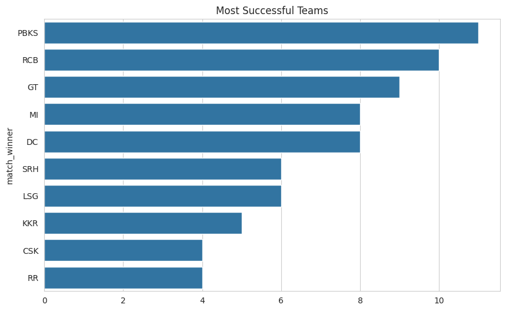

---

### Toss Winners Analysis

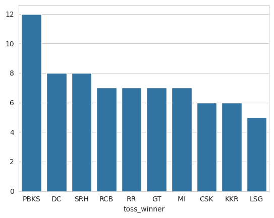

---

### First Innings Score Distribution

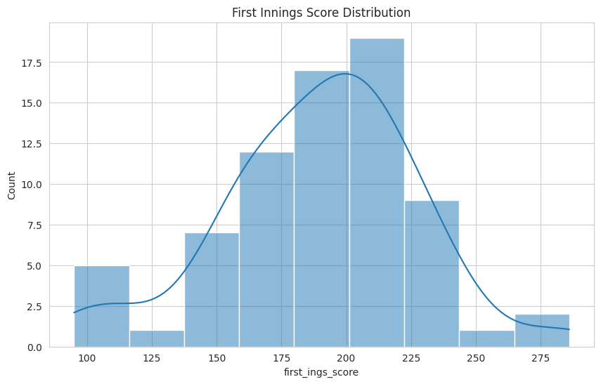

---

### Second Innings Score Distribution

---

### Match Result Analysis

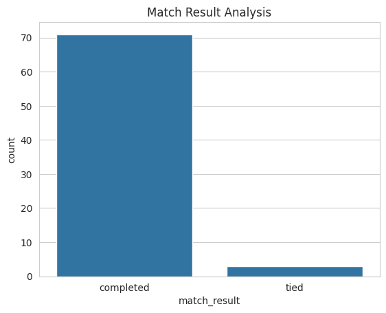

---

### Matches by Venue

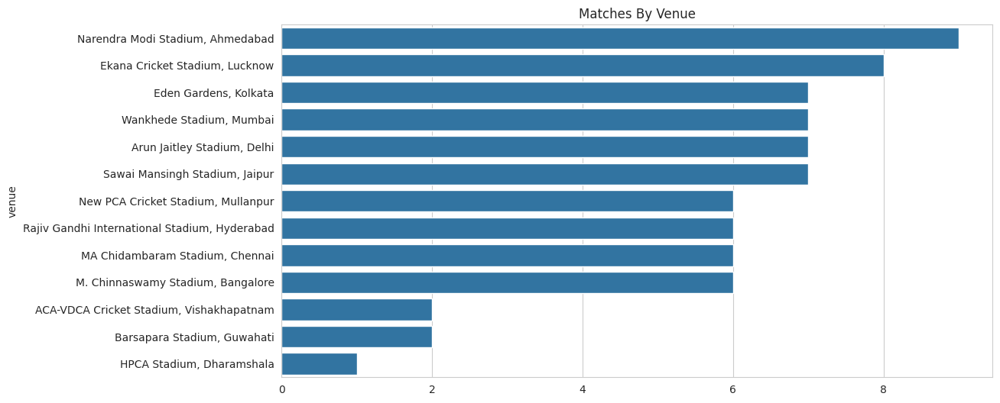

---

### Highest Individual Scores

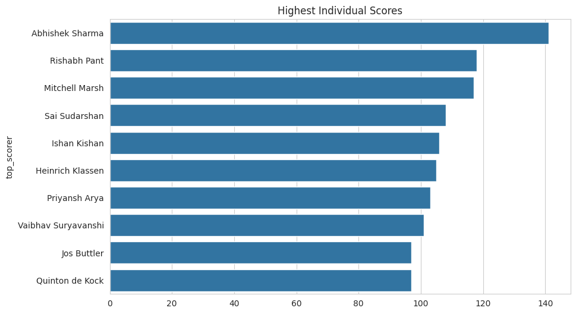

---

### Player of the Match Analysis

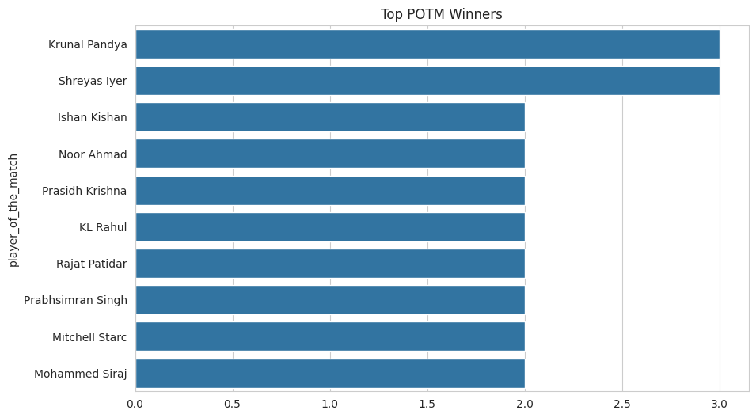

---

### Correlation Heatmap

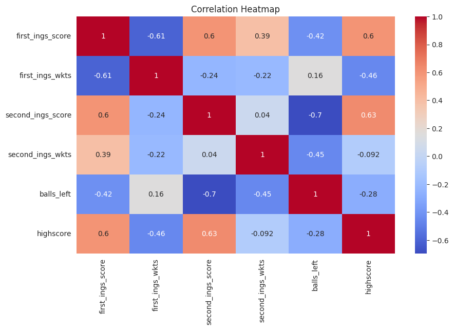

---

### Outlier Detection

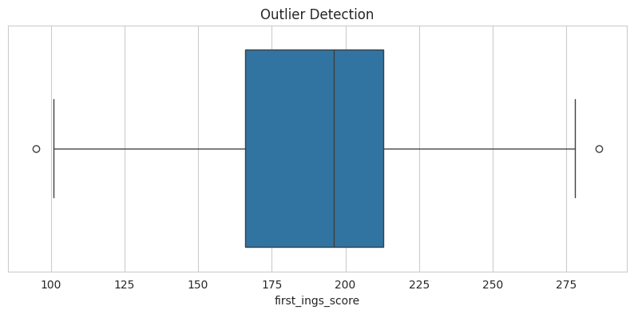

---

### Regression Analysis

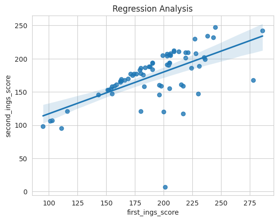

---

### First Innings vs Second Innings

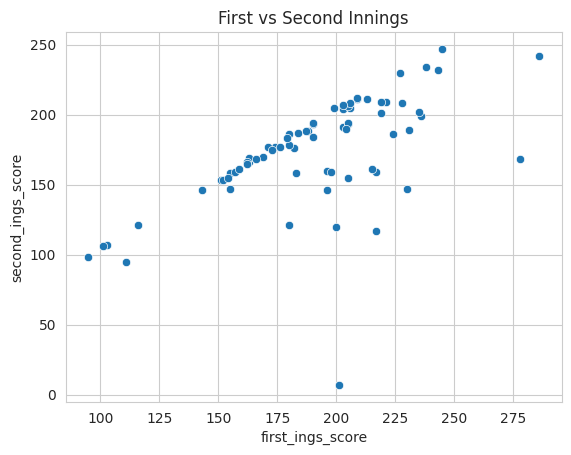

---

## 🔍 Key Insights

- Identified the most successful team of IPL 2025.
- Analyzed the impact of toss decisions on match outcomes.
- Studied score distributions across matches.
- Identified players with the highest individual scores.
- Evaluated venue-wise match distributions.
- Analyzed relationships between innings scores.
- Detected outliers in scoring patterns.
- Explored correlations among important match statistics.

---

## 💡 Skills Demonstrated

### Data Analysis

- Data Cleaning
- Data Transformation
- Data Exploration
- Statistical Analysis

### Visualization

- Bar Charts
- Histograms
- Box Plots
- Scatter Plots
- Heatmaps
- Regression Plots

### Python Libraries

- Pandas
- NumPy
- Matplotlib
- Seaborn

---

## 🎯 Project Outcome

This project helped strengthen my understanding of:

- Exploratory Data Analysis (EDA)
- Statistical Concepts
- Data Visualization
- Business Insight Generation
- Real-world Sports Analytics

---

## 👨‍💻 Author

**Lakshya Pandagre**

Aspiring Data Analyst | Data Science Enthusiast | AIML Learner

GitHub: https://github.com/lakshyapandagre-ux

---

⭐ If you found this project useful, feel free to star the repository.
